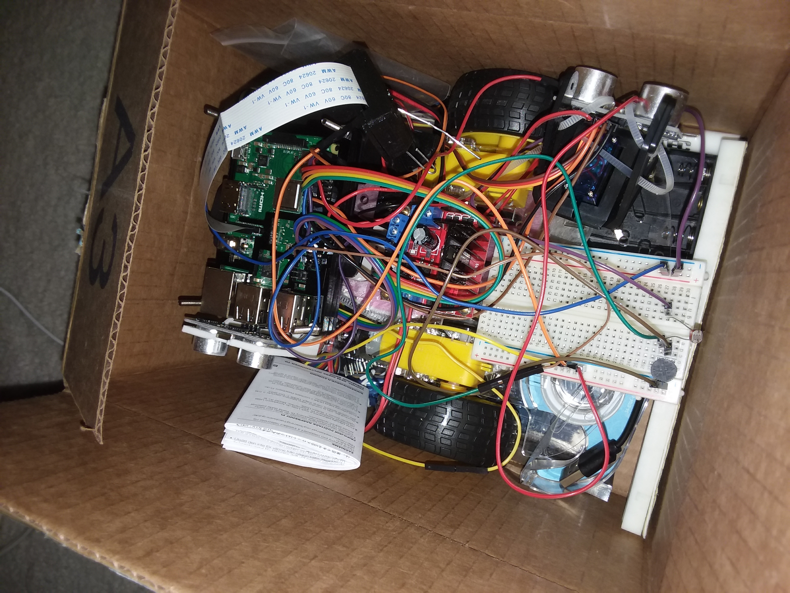

  
  

I took an Intro to Robotics class where we each had to purchase supplies for a robot and build them over the course of the semester. The robots had to have some way to remote control their actions or be completely autonomous. I programmed my robot with a simple WASD movement script. Like other classmates, I used a Raspberry Pi in my creation.

